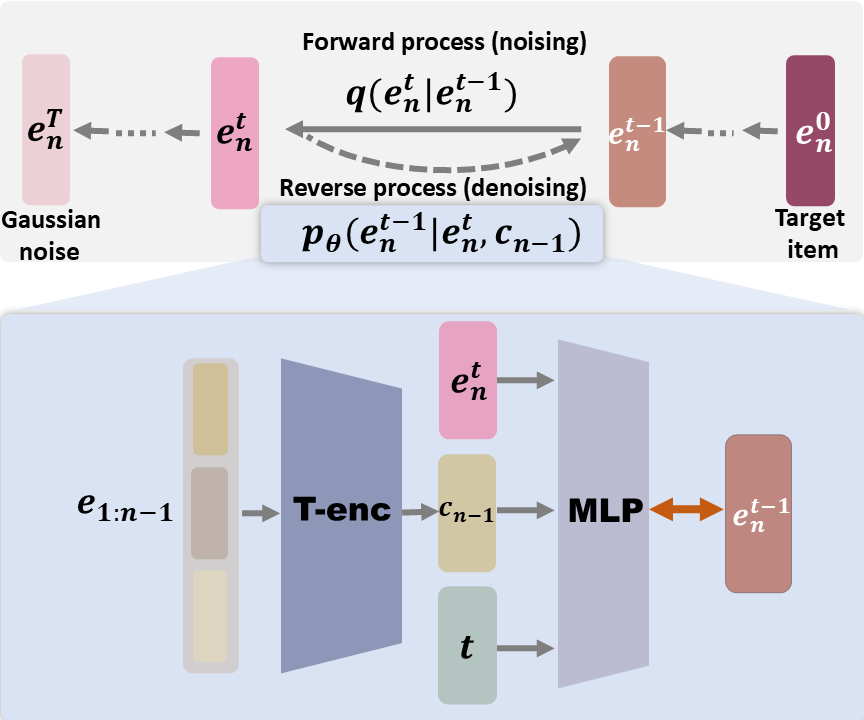

  cd DreamRec
  python -u DreamRec.py --data yelp --timesteps 500 --lr 0.001 \
    --beta_sche exp --w 2 --optimizer adamw --diffuser_type mlp1 --random_seed 100

  - PAD token = item_num (yc用9514, yelp用20033)                                                                                               
  - 序列格式: [有效items][PAD...],len_seq记录有效item数量
  - 所有4列(seq, len_seq, next)格式匹配  

  - train_data.df: 200,146个样本
  - valid_data.df: 28,592个样本
  - test_data.df: 57,185个样本

# DreamRec

This is the implementation of our NeurIPS 2023 paper:

> Zhengyi Yang, Jiancan Wu, Zhicai Wang, Xiang Wang, Yancheng Yuan, and Xiangnan He. Generate What You Prefer: Reshaping Sequential Recommendation via Guided Diffusion. In NeurIPS 2023. [arXiv](https://arxiv.org/abs/2310.20453)



## Reproduce the results

### YooChoose Data

```
python -u DreamRec.py --data yc --timesteps 500 --lr 0.001 --beta_sche exp --w 2 --optimizer adamw --diffuser_type mlp1 --random_seed 100
```

### KuaiRec Data

```
python -u DreamRec.py --data ks --timesteps 2000 --lr 0.00005 --beta_sche cosine --w 2 --optimizer adamw --diffuser_type mlp1 --random_seed 100
```

### Zhihu Data

```
python -u DreamRec.py --data zhihu --timesteps 500 --lr 0.01 --beta_sche linear --w 4 --optimizer adamw --diffuser_type mlp1 --random_seed 100 
```

## Brief introduction of RecInterpreter

In our more recent work RecInterpreter [arXiv](https://arxiv.org/abs/2310.20487), the oracle items generated by DreamRec can be instantiated by Large Language Models with textual descriptions. Please refer to the paper for more details!
